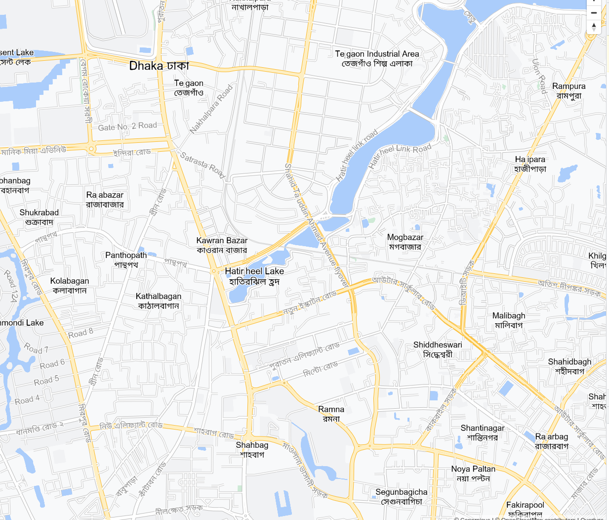

# index-by-grapheme

Index glyphs by cluster string rather than unicode codepoint in MapLibre GL JS

Feedback welcome in the MapLibre GL JS pull request:

https://github.com/maplibre/maplibre-gl-js/pull/2458

## demo

<a href="https://wipfli.github.io/index-by-grapheme">
    
</a>

Languages: Add a `&language=mr` to the URL to see the place labels in Marathi (`name:mr` in OpenStreetMap). 

* Hindi: https://wipfli.github.io/index-by-grapheme#lanugage=hi
* Tegulu: https://wipfli.github.io/index-by-grapheme#language=te
* Bengali: https://wipfli.github.io/index-by-grapheme#language=bn
* Gujarati: https://wipfli.github.io/index-by-grapheme#language=gu
* Malayalam: https://wipfli.github.io/index-by-grapheme#language=ml
* Punjabi: https://wipfli.github.io/index-by-grapheme#language=pa
* Marathi: https://wipfli.github.io/index-by-grapheme#language=mr
* Urdu: https://wipfli.github.io/index-by-grapheme#language=ur
* Persian: https://wipfli.github.io/index-by-grapheme#language=fa
* Arabic: https://wipfli.github.io/index-by-grapheme#language=ar

## How does it work?

* Use always the TinySDF codepath in MapLibre GL JS (rasterize glyphs in the client)
* Use [`Intl.Segmenter`](https://developer.mozilla.org/en-US/docs/Web/JavaScript/Reference/Global_Objects/Intl/Segmenter) to split strings into graphemes
* Run some custom merging of graphemes to get effective graphemes
* Use graphemes to index the glyph atlas rather than unicode codepoints

Source code: https://github.com/wipfli/maplibre-gl-js/tree/index-by-grapheme

## What can it do?

It can render complex text on point labels and along lines.

## What can it not do?

I don't know...

## Segement by Word

Segement by word might work better for some languages such as for example Khmer. There is a demo which uses 

```diff
         const segmenter = new Intl.Segmenter(
-             'en', {granularity: 'grapheme'}
+             'en', {granularity: 'word'}
         );
```

at https://wipfli.github.io/index-by-grapheme/by-word/. For this demo, I made the TinySDF canvas 200px large to accommodate for longer text.
